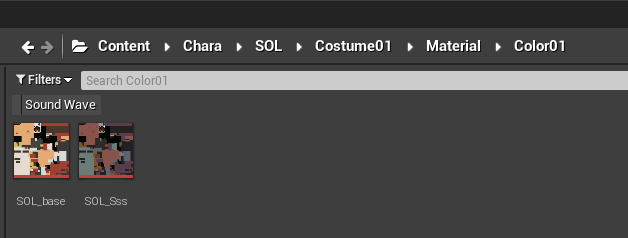
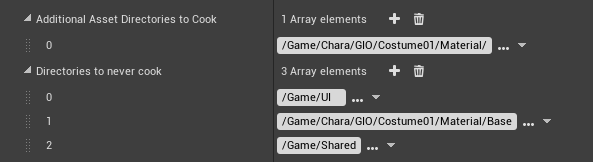

# Modding For Dummies
*This section was written by @muuyo*

 

Hello! As this wiki is decently in-depth and fragmented into different topics due to the nature of things, this is meant to be a "quickstart guide" for anyone stumbling in that doesn't really know where to start. It's *also* fairly in-development, so [contributions are welcome](https://github.com/muuyo/asw-modding-book) - I'll just be slow to merge if they're not to standards (bad grammar or explanations, etc)

If you're looking to *mod the game*, not make mods for it, please see [this page](https://gamebanana.com/tuts/14186).

You most likely want to start with recolors, as they're the most easily graspable, however if you're more a technically inclined / intuitive person like myself you can jump headfirst into model modding - just know that it's a bit of an in-depth topic, and you'll have to do a bit of discord searching.

On that note, here's the Unreal Anime Mods discord: [link.](https://discord.gg/tgFrebr)
 It's obviously a lot less "comprehensive" and structured a place to learn, however realistically you may find yourself having to message search for people with similar issues to you.

 Onto the modding!
 This is all from a Strive modder's perspective, however it should be generally the same as to other games, just with different conventions.

First, you'll need to extract assets from the game. You will most likely want to do this even if you're only making a recolor (to preview your work), but it's not strictly necessary.  
There are two tools for this; Umodel and Fmodel. 

[Fmodel](../tools/fmodel.md) is a more modern piece of software, and as of recent updates the much more suited application for exporting. [Umodel](../tools/umodel.md) is also available, but it's more antiquated and doesn't presently have any advantages, and exports worse files. 
Next, follow the [mesh importing section](../modding-mesh/mesh-importing.md) if you wish to extract models, or simply navigate to any texture and export them as a TGA otherwise.

Next, you will need Unreal from the [Installing Unreal page.](../ue4/getting-unreal.md) Download it, set it up as described there, and you're mostly in the money. However, I strongly recommend making a new project, separate from the one with all the game files in it, to work in - start from a clean slate. This is described more in-depth on the [Custom Project page, under the dropdown](../ue4/custom-project.md).

If you're just wanting to do texture work, it's pretty easy - you essentially want to replicate the structure of where you took the file from in Fmodel.  
For example, if I want to replace Sol's Color01 base and SSS, I simply have to create the file structure like this: (ctrl+shift+N to make a new folder, btw)
  
All unreal modding generally takes this workflow - *replacing files* by putting them in the same place they originally were.

Make sure that your *content is saved* by hitting File -> Save All, or hitting Ctrl+Shift+S. If any files have a little star on them, they won't properly save.

Finally, you need to **cook**.  
As you get later into working on projects, you will want to use this more, so I'll put it here; under Edit -> Project Settings -> Packaging, you can click the first dropdown (little arrow under the first section) to expand it and see these two settings. They are Quite Important.
  
The first one defines directories that you want to cook. Having this set will stop any other directories from being cooked, *except Shared*.  
The second is very important - if you have a Shared folder AT ALL, you need to put it here, or your mod will have *averse affects on the entire game for anyone who installs it*. Doing just this solves your problem. As well, if you're doing anything material-based, like instancing, you may want to put your Base folder here.

With that all of the way, just hit File -> Cook Content For Windows. This may take a while the first time you do it. If it errors out, see the Custom Project page again, as you likely did not configure your new project correctly.

You're nearly done! Now you need to pack up your files.
View the [packing page for more details.](../packing/pak.md)