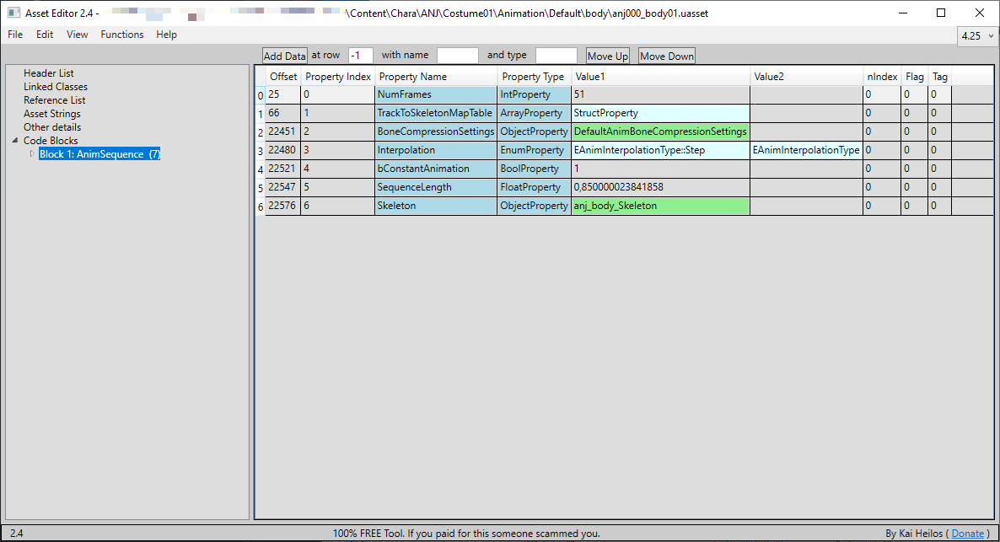
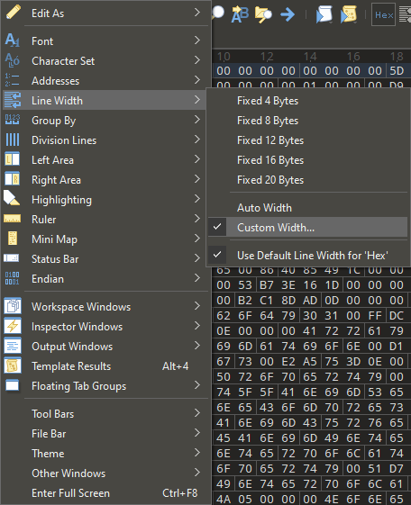
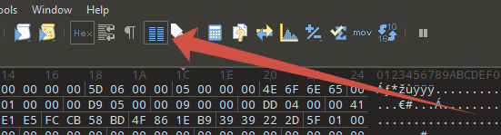
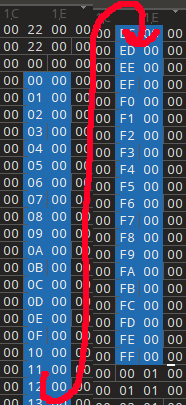
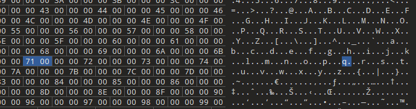

# HeX Editing animation
*This section is under construction and was written by @bafrag*
<hr>
<br>

This is where the fun begins. Without this your mod will crush the game.

1. Open your animation mod in Mod_Folder_Project\Saved\Cooked\...\body in AssetEditor. Open the original animation file with the same name. You need to copy the Sequence Length number. <div align="center"></div><div align="center">
2. The open both **.uexp** files in HeX editor. I will use 010 Editor because it will help with 1 step specially.

## HeX Editor
1. Set custom Line Width to 37 bytes per row <div align="center"></div><div align="center">
2. Enable Column mode <div align="center"></div><div align="center">
3. Then you need to select the 1D and 1E columns starting from the 00 above 01 to FF 00 values and copy that. <div align="center"></div><div align="center">
4. Do the same thing with edited animation's file but **paste** the values from the OG file.
5. After that, search 113 value. It should be in this are: <div align="center"></div><div align="center">
6. Go up till you find the 00 00 00 00 row. This is your start position for massive copy-paste. But where is the end?

## Fmodel
Open in the Fmodel OG animation file. There are many BoneTreeIndex lines. Those are the number of bytes you need to select. Pro tip: Copy-paste the whole file in text file, "Ctrl+F": BoneTreeIndex. And multiply the answer by 4.
```python
  "BoneTreeIndex": 0
},
{
  "BoneTreeIndex": 1
},
{
  "BoneTreeIndex": 2
},
```

## Continue HeX Editing
1. Starting from 00 00 00 00 row select range with the value you have found in the Fmodel part and copy it. Don't forget to disable the Column mode.
2. In the edited animation file select also starting from 00 00 00 00 and paste the values. If the new pasted values override the pasted column values, don't do this step.

Congratulation. Hex Edit works are done! Now you need to correct pak your mod.
