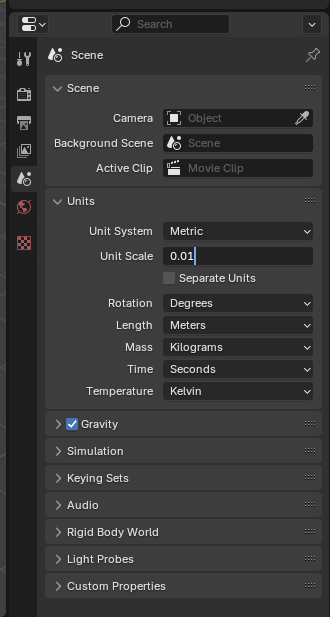
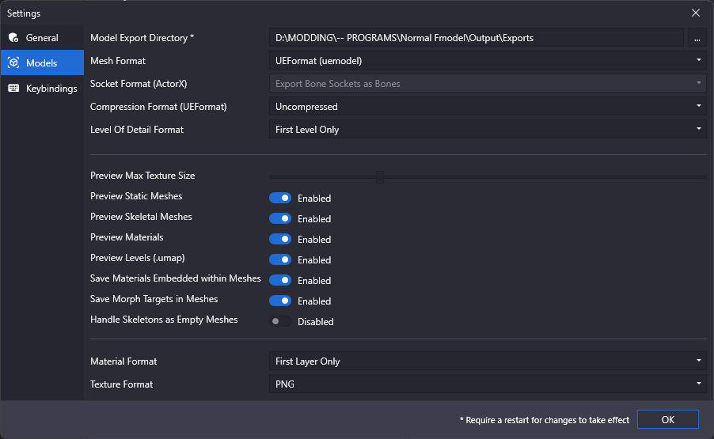
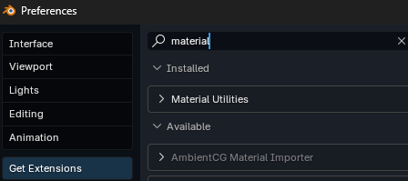
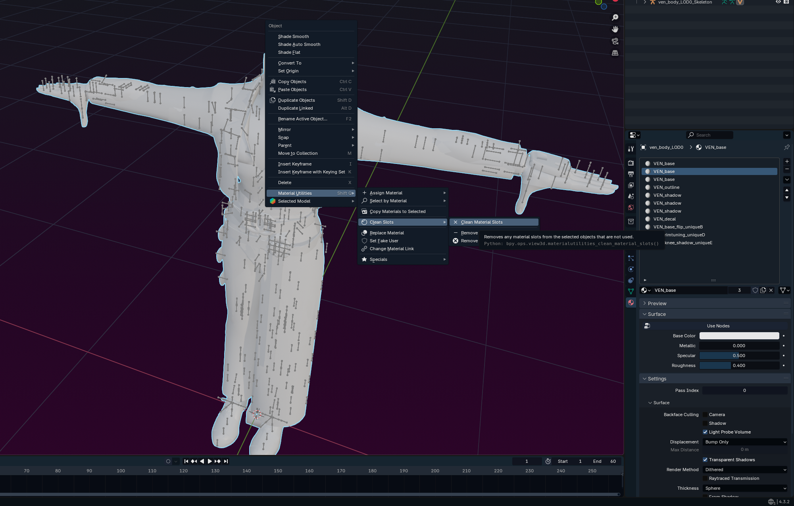
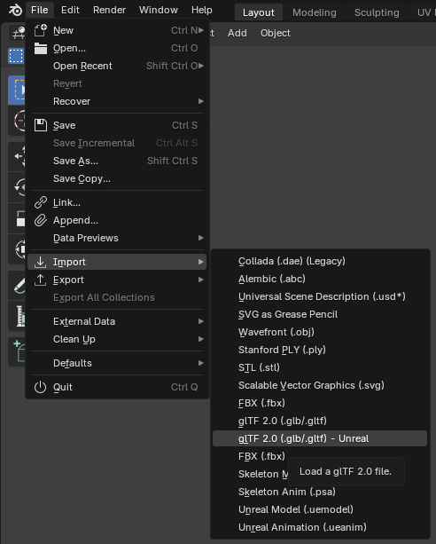
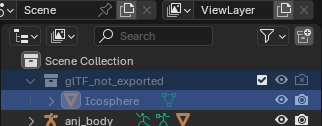

## Getting your mesh into Blender
*This section is under construction, and was written by @bafrag & @muuyo*

 

Some actions must be done in Blender **before** importing the model here:
  1. Set Unit scale to 0.01 

## Fmodel

### If using UEFormat from Fmodel, please note that you **will need** the Blender addon to import those files, linked in [this section](../tools/fmodel.md).

1. Set up Fmodel as described [here.](../tools/fmodel.md)
2. Set Fmodel to export as uemodel, under Settings.
   
3. Open GGST in the Package tree (under pakchunk01, usually) then navigate to any model in the model tree (e.x. `RED>Content>Chara>ANJ>Costume01>Mesh`)
4. Right click any mesh and hit "save model".
5. Click the file when it exports in the console log at the bottom (white underlined link) to navigate to it.
6. Copy the directory from Explorer's link bar to Blender's "File -> Import -> .uemodel" import dialog.
7. Change the Fmodel settings to what you need - I currently have "Scale" at 1.00 and "Bone Length" at 4.
8. Donezo. Many materials will be chunked (the model having multiple Blender material slots that are in fact the same original material), though, so it's recommended that you go into Mesh Edit mode and do this process;
   - for every material with the same name, use Select to select all vertices on that material
   - Assign them to the first slot of that material (merge ANJ_BASE with ANJ_BASE)
   - The above doesn't apply to material slots like `ELP_base_skirt` and `MI_MAIN_BASE_frip`; these are still unique, and shouldn't be merged with normal Base materials.
   - do this for each other chunked material
   - go into Object mode and delete the other slots (the ones you just removed all parts of the mesh from) with the - button.
  
 

 - Alternatively, install the Material Utilities addon to handle this process automatically. 
      
     - To do so, install the above addon then use it to clean material slots (since there's duplicates) then remove the extras manually using the Minus on the right (doesn't work in edit mode).
      
  
## Umodel
  1. Download the ASW-compatible modded .gltf importer [addon](../modding-mesh/files/io_scene_gltf2_ue.zip)
  2. Add the addons to Blender in Edit > Preferences > Add-ons > dropdown at the top right > Install from file
  3. You may have to *disable the Blender gltf addon first*, then enable the Unreal-compatible one you just downloaded.
  4. Import the model; 

  5. Delete Icospheres, or set the Viewport Display under Armature on your armature (green skeleton in Details) to Octahedral/Stick, depending on preference. You can completely hide it as well. 

  6. Rename Armature to "Armature"

Now you can go on to use this baseline, or get materials [onto your model.](../modding-texture/texture-blender-preview.md)
