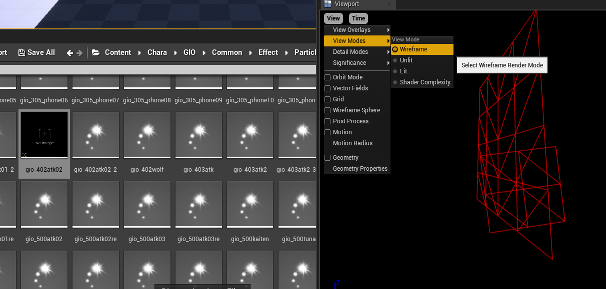

# Particles
*This section is under construction, and was written by @muuyo*

Particles are a bit of a strange art; they're pretty easy to understand however editing them is usually a process of guess and check, so it can be a bit annoying if there's not an existing character reference on how to edit them.

First, a few things;  
There are characters with **per-color particles**; these are found within a file called "ParticleData" in each ColorXX folder, and they make your life easy. You can use one of the programs listed in the editing page to edit these fine, and it's generally pretty easy to mess with them.  

If they're not per-color, they're **character-wide**. This has obvious downsides, however they're still perfectly editable. It just takes **a lot** more work. Not *hard* work per se, however you'll be doing a lot of sanity checking and trying out different solutions.

The general process of particle editing is a pretty different workflow from working on normal character files or anything.  
First and foremost, you never actually cook particles. You instead modify files from the game directly, without ever passing them through anything but UnrealPak.

- Firstly, save the asset for one of these files using Fmodel (preferred) or Umodel, elaborated upon in the [tools section](../tools/get-tools.md). Right click any particle file;
  - for per-color character particles, first look in a character's ColorXX folder for a file titled "ParticleData" and right click to Save the raw asset.
  - if they *don't* have one of these, you'll have to edit each and every particle individually. See the section below for that.

<b>[Dropdown]</b> Per-character particle hunting

This one's a doozy!
Temporary summary;  
These are found in the character's `CHR/Common/Effect/Particles/CHR_PTCXX/PTC` folder.
You can save these as assets based on their name. They should be **vaguely** self explanatory, however you can [compare it to the expected animation IDs which may help](https://docs.google.com/spreadsheets/d/1qrsX0QnmltX6DumfoRX7a76uvRJNh4AfU3QFdtOkcYc/edit) (although they may not even match up, or have IDs at all...)  
If you need a more robust way to preview what they're doing rather than editing each file in a guess-and-check nightmare, you have two options;  
- Preview them in Unreal using the Advanced Project.
  - When you're viewing the file, it'll be all black. To fix this, either
    - View it in Wireframe mode using the toggle at the top left.
     
    - You can view the material (and edit it to be white or something for easier viewing) using the individual particle "nodes" on the right. 

uhhhhh use ParticleEditor or UAssetGUI to edit those once you're done. they're called ColorOverLife i'm too lazy to write more rn
TODO: write moar