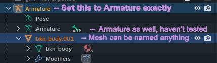
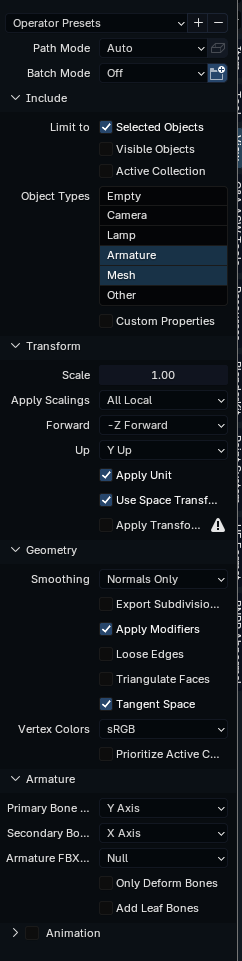

# Using Blender

*this section was written by @muuyo*

**Note that this document will not cover the basics of Blender.**
This section is thin, apologies.

## Blender FBX export into UE4

You are going to need the modded FBX addon by Ryn for anything related to mesh exporting. It can be acquired [here.](../modding-mesh/io_scene_fbx_arcsys.zip). **This only works on Blender 4.3 and below.** 

When exporting with this, you first **need to set your armature's name to Armature**; else, your mesh will be completely invisible. For particle meshes (ones without armatures), this is avoidable. (The below image is a little off; the second Armature can be named anything)  
  
Select your mesh then your armature; then, export with these settings.  
  
You may want to turn on Triangulate Faces. As well, if your Unit Scale (in your project) is not .01, change Scale to .01. You can save all these settings using the Operator Presets at the top.

## Aerthas' custom materials & shaders

[Download BLENDER-Arc-System-Works-Shader](https://github.com/Aerthas/BLENDER-Arc-System-Works-Shader)

While not strictly needed for modding, the shader is highly recommended for previewing models and textures within Blender itself.

Aerthas made a ton of practical videos on how to use his shader. [Here is a link to a playlist containing said videos](https://www.youtube.com/playlist?list=PLCkHUM_E60CSi1HowXR3v4uVWNqUDsl9l).

## Scripts

[Browse Arc-Sys-scripts](https://github.com/SaitsuP/Arc-Sys-scripts)

These scripts have their own [wiki pages](https://github.com/SaitsuP/Arc-Sys-scripts/wiki), which also go into detail on how to use them.

