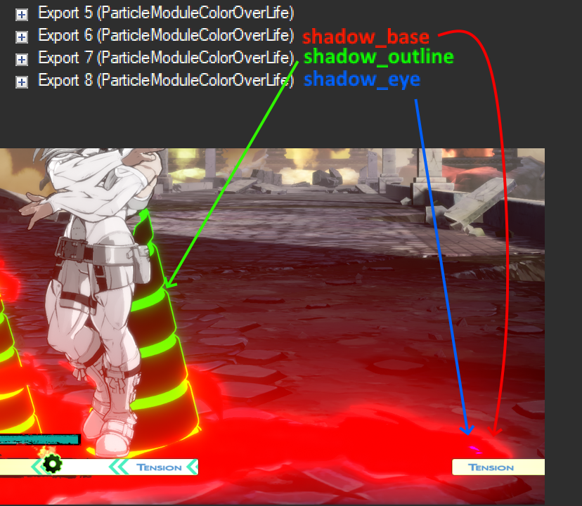
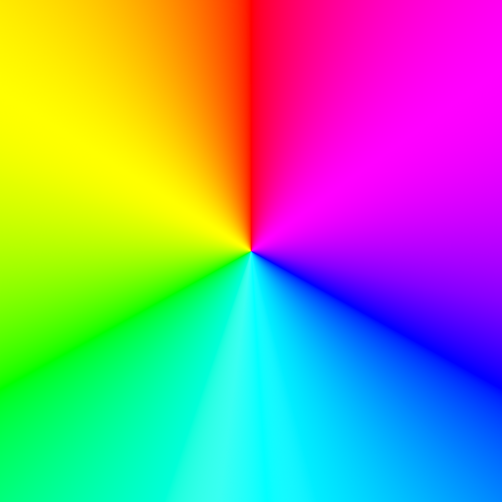
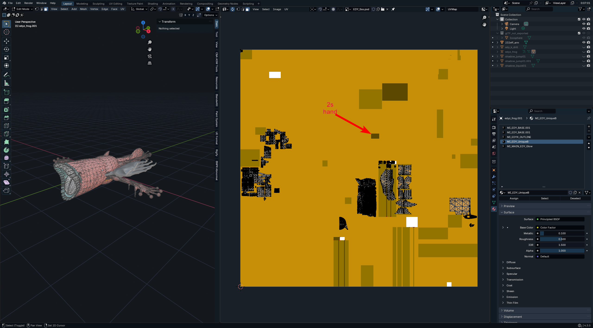

# Zato guide
*this section was written by @muuyo*

 
 My notes from when I was working on this

okay so  
gonna begin by referencing this snippet from the UAM discord;

hm. okay so  
looking in the UE4 red project  
all these materials aren't, like, placeholders; these all instance correctly to the normal materials which are fully implemented.  
this means i might just be able to cook the Zato folder directly, and I *never* have to change anything? like no uassets??  
we might be so back?  

E: lol past muuyo was completely wrong. zato has a good few special materials. however, you CAN just make a material with the same params and then it works if you don't actually cook that.  
ERGOOO, i made a few custom mats and now you can cook without as much asset editing!

okay notes to self
package the charamatetrial/edy folder
**package M_Glow**

SO! here's my (hopefully) new-and-improved way to make Zato recolors that include Eddie, with only a *little* particle finagling

I've essentially reduced the previous process of guess-and-checking and editing UAsset files directly to editing materials in UE4 normally (though particle colors still have to be edited)

So;  
The below zip contains the files needed to edit Eddie in Unreal. Note that *it comes with some that should NOT be cooked; please follow [the cooking section on this page](../ue4/unreal-exporting.md) to set up your cooking directories so that you *only cook your Color01 folder*.  
Copy them over to your Unreal by placing the zip's contents in your Content folder; Shared merging with Shared, etc. (If it's not working, you probably [need the CharaMaterial folder.](../ue4/getting-unreal.md))  

EDY_SSS defines most of Eddie's "model" colors; e.g. Zato's dash surfboard, 

Here's a writeup from Noah in the UAM discord as to parts of Zato's materials/PTC; it contradicts this at points.

 
 dropdown snippet

MI_EDY_BASE  
Taste_color: Main Eddie color  
OutlineColor - Probably invisible as a fade-to  
MI_EDY_OUTLINE  
OutlineColor - Probably invisible as a fade-to  
OutlineColorEx - Primary outline color  
MI_EDY_UNIQUE_A  
Taste_Color - Executor spine and eyes  
OutlineColor - Mirage effect on Zato outline on things like flight  
OutlinecolorEx - Mirage effect on Zato outline on things like flight  
MI_EDY_UNIQUE_B  
Color - Markings on Eddie, some Eddie eyes  
PTCColorAndMaterial  
0 - Probably invisible as a fade-to  
10 - Puddle  
11 - Executor outline, some transitions from Eddie to Zato like landing animation  
12 - Dark Eddie details like mouth and the shadow's eyes on 2H / attached normals  
EDY_BASE  
Texture file - Mesh texture for things like Drunkard Shade's mouth interior, j.S and j.D mouth, BTL. Important to keep as just flat colors.  

NOTES
2P and 5P are governed by MI_EDY_BASE. 
2S is PTC 10 [THIS IS WRONG!]

### I would recommend using Blender to load the particle meshes (`ZAT\Common\Effect\Particles\ZAT_PTC01\Mesh\`) if you need to recolor something specific! View the UV maps!!! 

Here's what each part does;

Each particle (viewed in UAssetGUI as it can edit all values. ParticleEditor can only do some) does these; the top does nothing.  
The colors on these combine strangely, so use with caution.  
all 3 are set to 10; Base seems like it should be set to 1.

<video controls src="2025-02-21 00-36-26.mp4" title="zatocolors"></video>

<b> DROPDOWN - Various miscellaneous pieces of info</b> 

Here's what each of Zato's animations look like with the SSS set to a rainbow gradient, like so (all of Zato's particle/mat colors are set to gold and white, for a recolor):  

<video controls src="GUILTY GEAR -STRIVE- - 2025-02-22 3-37-40 PM.mp4" title="StriveVideo"></video>

Here's the frog's mouth and the 2s hand since they were driving me insane;

