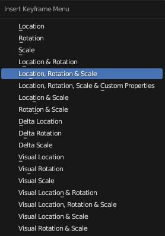
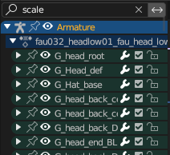

# Editing Animation
*This section is under construction and was written by @bafrag*

 

Editing is actually easier than you can think.
1. First, you need to acknowledge where the animation is used. Here is the [list](https://docs.google.com/spreadsheets/d/1qrsX0QnmltX6DumfoRX7a76uvRJNh4AfU3QFdtOkcYc/edit?usp=sharing)
2. Then you need to set right Frame Range. Open is Asset Editor the animation file, look at NumFrames line and subtract 1. In this case Frame range is from 0 to 50 frames. 

3. To edit anything select the Armature and go to the Pose mode. Move/Rotate/Scale each bone as you want. Press "I" and choose "Location, Rotation & Scale" if you use Blender 3.6 version. 

4. After edit works in Graph editor search "scale", and move the values by y0.01 

