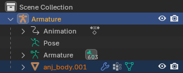
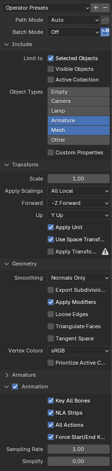
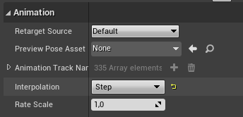
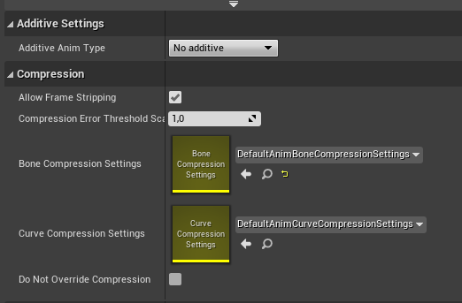
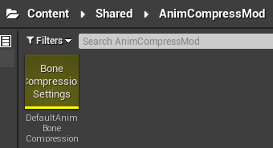
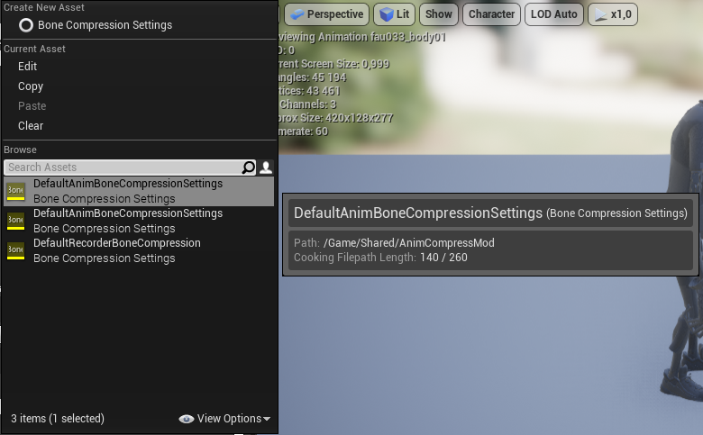

# Export Animation in the Unreal Engine
*This section is under construction and was written by @bafrag*

 

## Blender
1. While holding Ctrl select first the model and then the Armature 

2. Export as FBX with these settings: 

3. The file name should match the .uasset file + add _mesh. anj000_body01_mesh in our case.

## Unreal Engine
1. Recreate the full folder path. "Chara\Costume01\Mesh", "Chara\Costume01\Animation\Default\body"
2. Press Import and import the .fbx file with these settings: 

3. After installing move the animation file to Chara\Costume01\Animation\Default\body folder and other to Mesh one.
4. Open Animation file and set Interpolation to Step 

5. Scroll down till you find Bone Compression Settings and copy it. 

6. Create the Shared\AnimCompressMod path and paste here copied Bone Compression Settings 

7. Open the animation file again and choose the Bone Compression Settings from Shared\AnimCompressMod folder 

8. Make sure that every file is named correctly, save all and cook for Windows.
