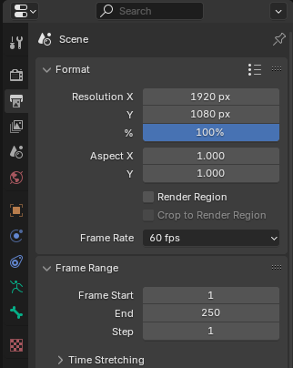
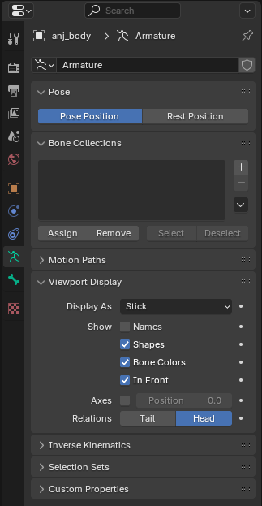

# Import Animations in Blender
*This section is under construction and was written by @bafrag*

 

## Before Importing
  1. Set Unit scale to 0.01 

  2. Set Frame Rate to 60 

## Umodel
  1. If you extracted as .gltf files you need to import those.
  2. Set bones to Stick. 

  3. Open Animation tab.
  4. Below change Dope Sheet to Action Editor.
  5. Select the Armature and then below animation you want to change.
  6. Press "T" and set Interpolation to Constant.

## Fmodel
Same, Idk anything.
