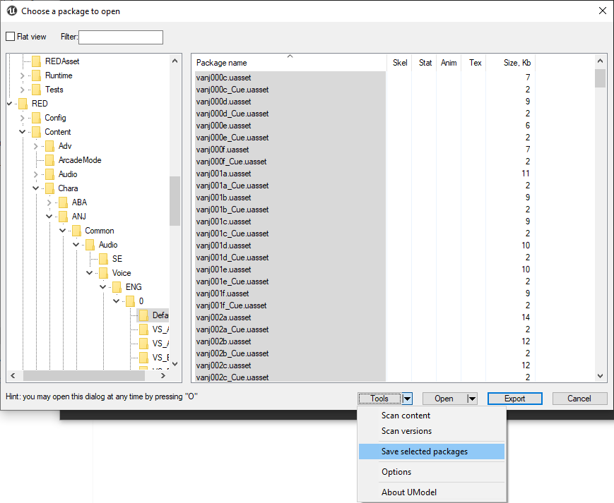
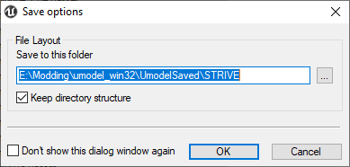

# Audio Extracting

In this section you'll learn how to extract audio files from the game

Common audio paths:
* /Content/Chara/XXX/Common/Audio/SE is for special effects for chara
* /Content/Chara/XXX/Common/Audio/Voice/LANGUAGE/№/Default is for common audio for chara.
* /Content/Chara/XXX/Common/Audio/Voice/LANGUAGE/№/VS_YYY is for lines versus specific chars.
* /Content/Audio/BGM is for Back Ground Music.
* /Content/Audio/Narration/JPN/Default is for Narrator lines.

## Umodel

1. Set up umodel.exe as written in [section 3.2](umodel.md)
2. Navigate to the audio path. In that image I have selected Anji's voice lines. 
  

3. Press Tools -> Save Packages and set the folder, where all saved files go and hit OK. 
  

## Fmodel

1. Open Fmodel and navigate to the audio path.
2. Right click the file and export as .uasset

## Reformatting to .ogg format

1. Extract [Audio Extracting](Audio_Reformating.rar) above the saved .uasset files.
2. Run ExtractAudio.bat program. This program extract .uassets files to .ogg format.
3. Additionally run deluasset.bat and deluexp.bat to delete the left .uasset files.
4. Now you can actually open the .ogg file and replace the music/voice as you want. Make sure that edited audio file matched the original .uasset file.

Here are more detailed explanation what each audio file is for: [GGST Voice Index](https://docs.google.com/spreadsheets/d/11PsNJKVTrTNZMvTZwtiOynj6Hf_V4u4SAqs8_j6eA2A/edit?gid=858024613#gid=858024613), [Guilty Gear -Strive- ID List](https://docs.google.com/spreadsheets/d/12YpixyoXmRlA_k7agLf1E8IMzKi1_AyNRjQ9shPaatw/edit?gid=965014000#gid=965014000) and [DBFZ IDs by Saitsu](https://docs.google.com/spreadsheets/d/10m1rGU7_W_VDCMGr2WfJDmFYrTg2-JPbhbfS4qKpqJ0/edit?gid=0#gid=0)
