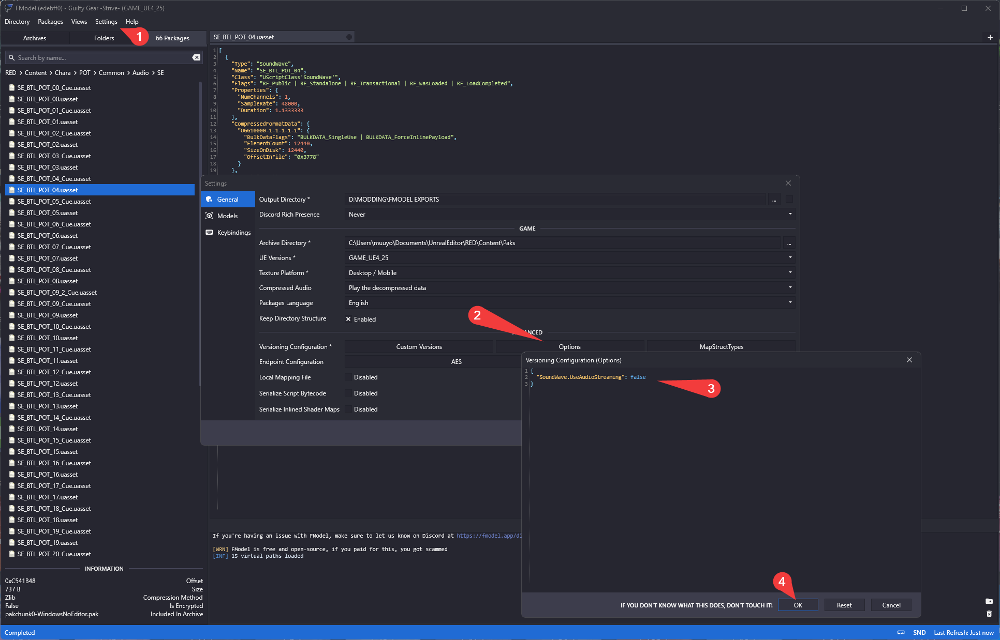

# Audio

*this section was written by @muuyo*
<hr>

So! Audio.  
There are two processes for this; the first I'd recommend for the majority of situations, however if you're handling audio from a bunch of different places in your game, then you may wish to do the second.

Firstly;
- Audio locations:

  |Audio type|File location|
  |-|-|
  |Character audio|`Content/Chara/XXX/Common/Audio/(SE/Voice)`|
  |"Universal" battle sound effects|`Content/Chara/*CMN*/Common/Audio/SE`
  |Background music|`Content/Audio/BGM`|


-  [This google sheet](https://docs.google.com/spreadsheets/d/1qrsX0QnmltX6DumfoRX7a76uvRJNh4AfU3QFdtOkcYc/edit) may be helpful for figuring out which file is which; each sound file usually has an animation ID in its name, that would correspond to these.

## Handling audio natively within Fmodel
Fmodel has innate support for Unreal's audio files, and you can preview and export them without using previously required conversion tools. However, this requires a quick settings change.  
Open Fmodel, and go into your Settings. Then, hit "Options" under Versioning Configuration, and input the below text:  
```json
{
  "SoundWave.UseAudioStreaming": false
}
```
Visual below;
  
Now, you should be able to open any audio file within the game files, and double click to play (note that Cue files don't count).  
To export, within this new Audio Player window, simply right click the file on the left (e.g. SE_BTL_XXX_01.ogg) and hit Save; it'll be exported to your Fmodel export directory.  
To save multiple at once, shift+left-click all the files in the Packages panel (of the main Fmodel window) that you want to export to select them all, then right-click and Save Playlist in the Audio Player window.  
(To clear the audio window, just close it.)

If you're looking to *mass* export audio files, beyond one character's voice lines in one language or something, I recommend using the below instead.

## Mass file conversion using VC.exe

Long story short, the process essentially goes "save uassets using fmodel -> convert them to audio using the batch -> done"

So;
- Install Fmodel using [its guide](../tools/fmodel.md)
- Browse to where the assets you want are
- right click the folder with all the assets you want to save (each asset is a sound file, usually easiest to do the whole language folder)
- Export Folder Package's Raw Data (uasset)
- Drop [this zip file](./UmodelSaved.zip)'s contents into wherever you extracted them (click the underlined text at the bottom to navigate there)
- The contents of this zip do a few things:
  -  ExtractAudio loops through all folders inside the current folder, and converts assets to .oggs (putting them in the same place)
  -  deluasset and deluexp delete all of their respective files after you're done; just clears up clutter.
-  Now, simply run "ExtractAudio" and all the files get converted.

## Modding new audio into the game
Adding audio as a mod is pretty simple; put a **wav file** in the matching place in your Unreal project, then cook as normal. Volume and pitch can be changed within Unreal, as well, under file properties.