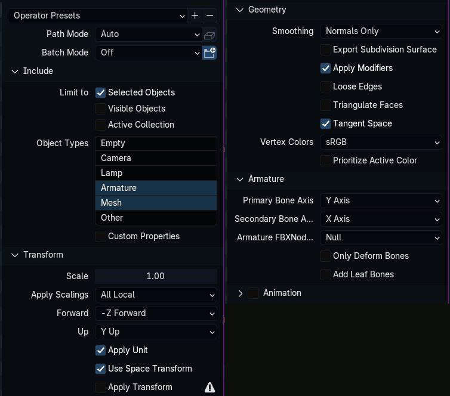

# Model Exporting in Unreal Engine 4
*This section is under construction, and was written by @bafrag*

 

## Exporting
Now, to export:
1. First select the model itself, then while holding Ctrl select the Armature.
2. Open the Export as FBX menu and *make sure it says "Export FBX (Arc System Works)"* on the confirm button
3. Put in these exact settings (the one that differs from standard exporting is "Tangent Space") 

For ease of use, I recommend hitting the plus at the top right and adding a preset (named anything). You can select these presets on subsequent launches by using the dropdown.
Afterwards, export to FBX as standard (using the filename that the game's model originally had)

## Importing
  1. Recreate the folder path. Chara\ANJ\Costume01\Mesh for example
  2. Press "Import" button and import the .fbx file.
  3. Here are import setting: 

