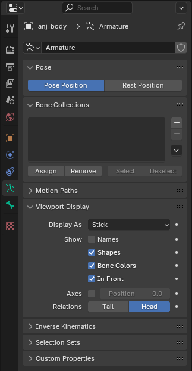
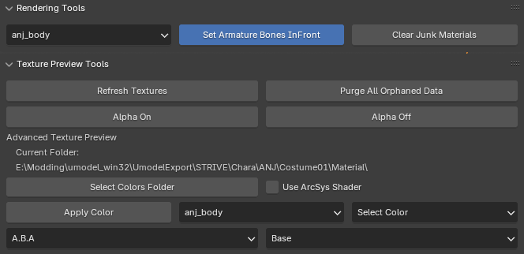
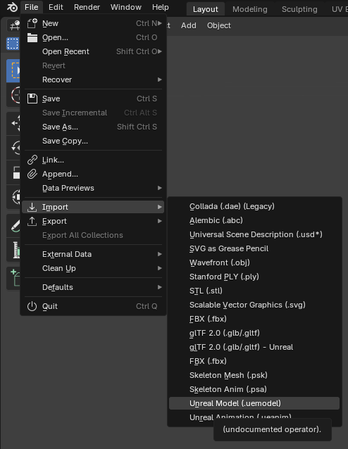

## Getting your mesh into Blender
*This section is under construction, and was written by @bafrag*

 

If using UEFormat from Fmodel, please note that you **will need** the Blender addon to import those files, linked in [this section](/tools/blender.#fmodel-with-arc-system-works-animation-support).

Some actions must be done in Blender **before** importing the model here:
  1. Delete all default objects.
  2. Set Unit scale to 0.01 

If you use Fmodel for exporting models from the game, don't forget to install the [addon](modding-mesh\files\io_scene_ueformat.rar) for Blender to import .uemodel format in the program.

## Umodel
  1. Download .gltf [addon](modding-mesh\files\io_scene_gltf2_ue.rar) and Abnormal addon from [here](https://github.com/bnpr/Abnormal/releases).
  2. Import the model 

  3. Delete Icospheres 

  4. Rename Armature to "Armature"
  5. Optional: Either set Viewport Display in Armature window to Stick or Using C&A ASW Tools set Armature to do it automatically 

## Fmodel
  1. Import the model 

  2. *I've never worked with Fmodel uemodel, muuyo, help*

Now you can edit model as you want.
