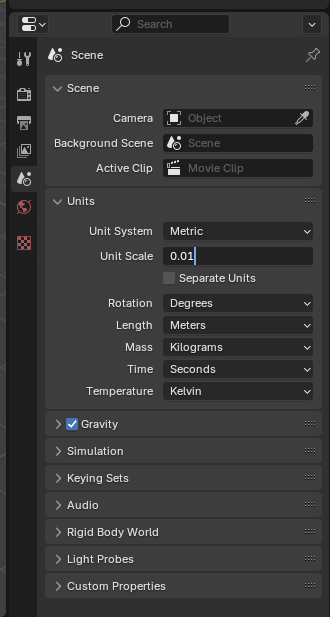
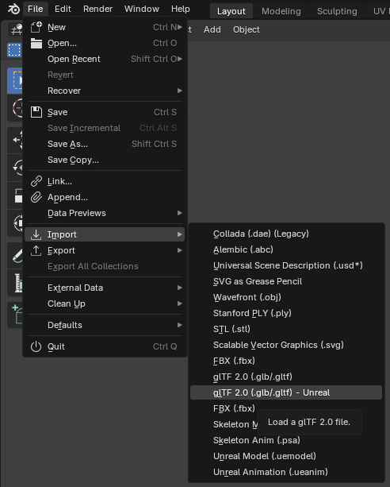
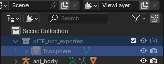
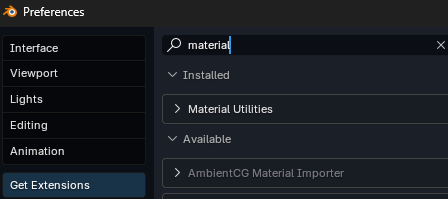

## Getting your mesh into Blender
*This section is under construction, and was written by @bafrag & @muuyo*

 

If using UEFormat from Fmodel, please note that you **will need** the Blender addon to import those files, linked in [this section](/tools/blender.md#fmodel-with-arc-system-works-animation-support).

Some actions must be done in Blender **before** importing the model here:
  1. Set Unit scale to 0.01 

If you use Fmodel for exporting models from the game, don't forget to install the [addon](modding-mesh\files\io_scene_ueformat.rar) for Blender to import .uemodel format in the program.

## Umodel
  1. Download .gltf [addon](modding-mesh\files\io_scene_gltf2_ue.rar) and Abnormal addon from [here](https://github.com/bnpr/Abnormal/releases).
  2. Import the model 

  3. Delete Icospheres, or set the Viewport Display under Armature on your armature (green skeleton in Details) to Octahedral/Stick, depending on preference. You can completely hide it as well. 

  4. Rename Armature to "Armature"

## Fmodel
I would not recommend using Fmodel, as it does not seem to export material names on many models (at least in my experience.)
1. Set up Fmodel as described [here.](../tools/fmodel.md)
2. Set Fmodel to export as uemodel, under Settings.
   
3. Open GGST in the Package tree (under pakchunk01, usually) then navigate to any model in the model tree (e.x. RED>Content>Chara>ANJ>Costume01>Mesh)
4. Right click any mesh and hit "save model".
5. Click the file when it exports in the console log at the bottom (white underlined link) to navigate to it.
6. Copy the directory from Explorer's link bar to Blender's "File -> Import -> .uemodel" import dialog.
7. Donezo. You will not have material names, however if you go into your model's corresponding Color01 folder and view "Base.uasset", it has the materials per model listed there. Many materials will be chunked (the model having multiple Blender material slots that are in fact the same original material), though, so you'll have to guess and check. It's difficult to explain, but generally a process learned over time - since it has to chunk for *larger materials*, though, it's usually just MI_MAIN_BASE.

Now you can go on to use this or get materials [onto your model.](../modding-texture/texture-blender-preview.md)
