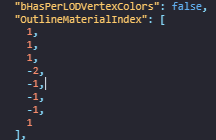
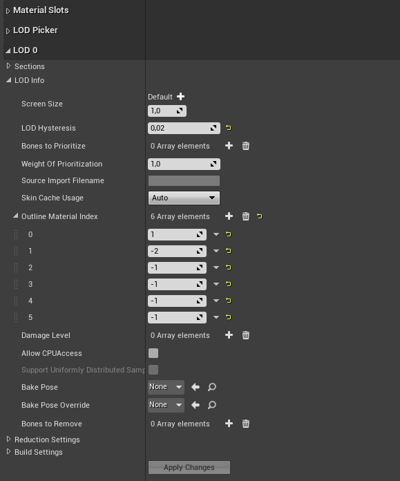

# Setting outline
*This section is under construction, and was written by @bafrag*

Now you need to set the outline index in the model.

 

1. Open the model in Fmodel and open the model in Unreal Engine.
2. Go through OutlineMaterialIndex list as shown here: 

3. Those numbers are how each outline works with each material. Go to LOD0 -> Lod Info section in Unreal Engine, create the amount of outline sections as in Fmodel. Then fill the array elements 

4. Now you can Save all and cook project for Windows
