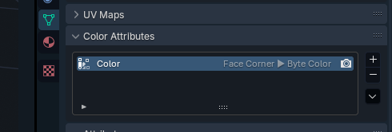
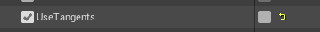

## Get your model outlines
*This section is under construction, and was written by @muuyo*

 

okay so  
quick rundown
no editor speak for this one  
you got two options to make outlines work:
- set up tangents on your model, do a bunch of work, re-do it every export, but a bit better results (allegedly)
- don't do that, get pretty much the same results (AFAIK)

but to do either of those you need to do vertex colors first so
# VERTEX COLORS

remember, use blender 4.2, it's the only thing compatible with every tool you need
- get Vertex Color Master from [here](https://github.com/CGDJay/VertexColorMasterUpdate-blender-3.6-/releases/tag/1.4)
- install it into blender
- if your model doesn't have a Color attribute (properties at bottom right, then hit the little green triangle, then hit Color Attributes; you should see this:)

- if you don't, click the little plus and add one with those settings
- cool. now select your model, change to Vertex Paint mode, hit the little VCM on the right
- change "Active Channels" to just A (to make Alpha the one you're editing; rundown of what each does [here](https://docs.google.com/document/d/1ejZ9TrIFNwiawLcFj-XRtaO3Vg9TxD04sR8HKOaRkGI/edit))
- Isolate Active Channel
- change Brush Settings to 0.73, hit Fill With Value, then Apply Changes

okay, that's done
now to
# THE UNREAL HALF
you have two options: tangents or normals

|tangents|normals|
|-|-|
easier to set up on the Unreal end | you have to set up One thing in unreal
requires re-doing every export | don't have to do anything in blender
doesn't work with models that have non-triangular faces | works with anything, afaik
theoretically more accurate (and controllable) results | one-and-done

for tangents, go to [the tangent section](../mesh-tangents.md)

for normal based outlines:

- you'll be using a copy of MI_MAIN_OUTLINE
- copy it from the advanced project's Shared/CharaMaterial folder to anywhere **(use the updated ver, from [here!](../ue4/getting-unreal.md))**, I usually just put it under `XXX/Costume01/Material/Base/` then I rename it to something specific to my mod.
- right click, Create Material Instance, rename it to MI_MAIN_OUTLINE
- open that material instance, and *change the setting UseTangents to off.* note, the first checkbox changes *whether you're changing that value*, the second changes the actual value. like this:  

- set up the other stuff too. i don't think you need to set up olm and SSS? just know those settings are there if it doesn't work / you're doing recolors / etc. this material is also how cool custom outlines are done, like red ones.
- you should be done. apologies, haven't tested, this is a quick writeup. should work though. just make sure the file is named correctly, MI_MAIN_OUTLINE.