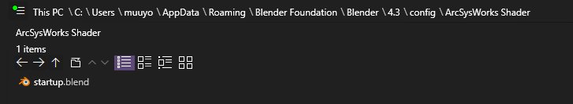
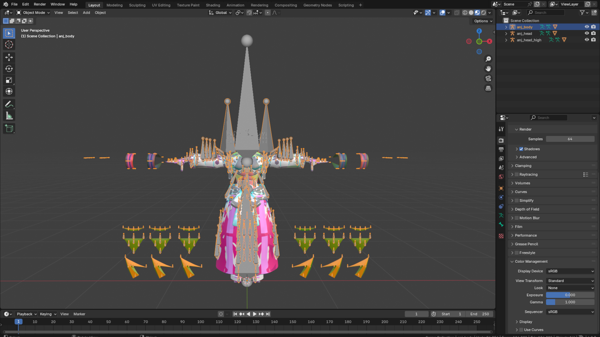
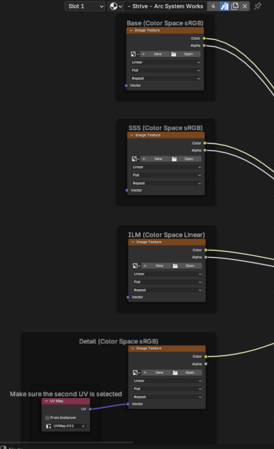

# Preview in Blender
*This section is under construction, and was written by @bafrag & @muuyo*

In this section, we'll overview how to preview your models with edited textures in Blender.

First, I recommend using this [this template](startup.blend) to have everything laid out already; materials and such come with. You can hit N when using the Blender Open dialog to disable the "Load UI" checkbox to keep the one already loaded. You can also add it as a startup file by putting it here; it'll be available on startup (the folder name just changes the Template name).

; 

If loading this template is undesirable, you can instead **Append** the object "Sphere Of Materials" and all will be added to your project.

**Finally**, [you can use C&A ASW Tools to hasten this process considerably;](../tools/blender.md#asw-modding-tools) just load the addon, use it as described in the doc there, and it'll handle all of this MUCH more easily. If you instead wish to do it manually, see ahead.

To preview textures on a mesh, first import the models into Blender as written in [section 9](modding-mesh/mesh-importing.md).
Afterwards;
   
1. Set Viewport settings to Material Preview, circles at the top right.
   
2. If you want to use those models only for recolours you can delete their Armature if you wish, because you won't need to export the model. Choose the armature and either press Delete. 

1.  If the materials on your model are showing up as dummy_material, please use the updated GLTF importer as seen here.

2.  Open the Shader Editor tab below instead of the Timeline. Choose the slot with the Base material (usually named eit...her "- Strive -...", or "MI_MAIN_BASE). Here, you input each texture into the shader. 

3.  Go to Base. Click on the folder icon and select your _base.TGA. Select it to put it into each node. Do the same thing with the other textures, such as SSS/Detail.

4.  For the ILM, go into your character's `Material\Base\` folder and input the texture. You will most likely have to change the Color Space on it from RGBa to Linear (or Linear Rec.709 on more recent versions of Blender)

5.   You should now see a proper looking model in Render, minus some bits.

6.  Do the same with the "Decal/Damage" material, putting it over the MI_MAIN_DECAL material on the mesh (and renaming it as such) then inputting the XXX_Decal into the shader panel. This *also* requires Linear (or in more recent Blender versions, Linear Rec.709)