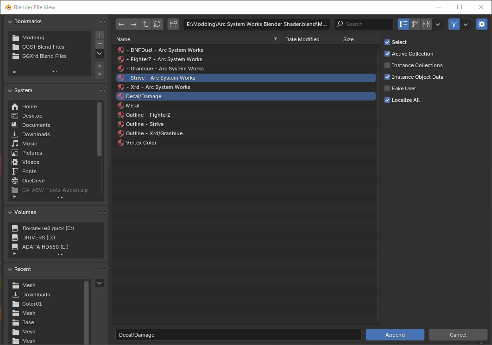
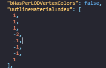
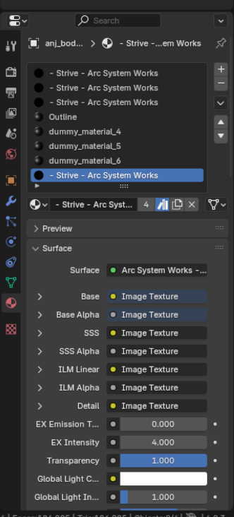
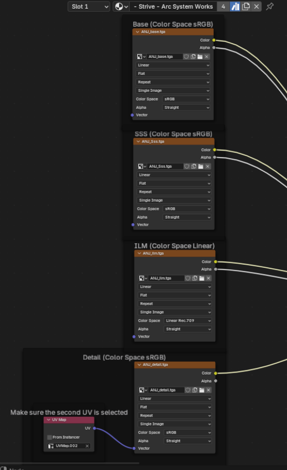
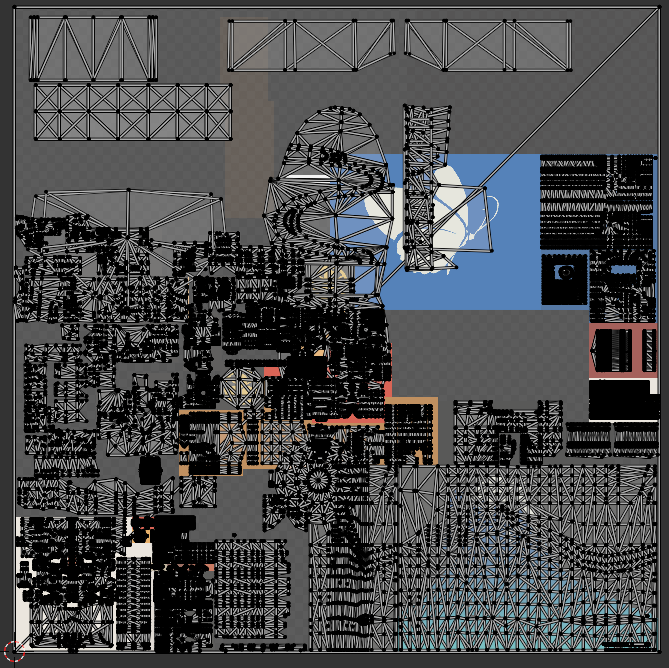
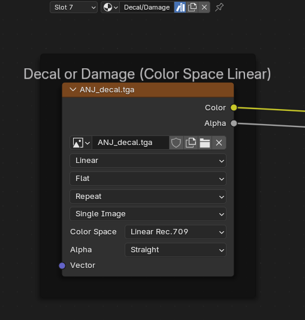
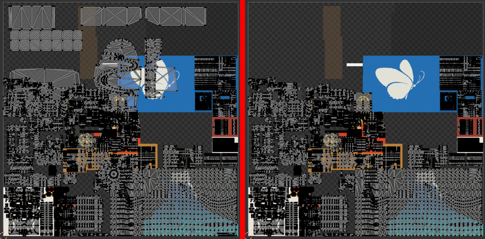

# Preview in Blender
*This section is under construction, and was written by @bafrag*

In this is section you'll know how to preview your models with edited textures in Blender.

To preview textures in Blender you need first import the models in the Blender as written in the [section 9](modding-mesh\mesh-importing.md)

After importing the models in Blender
1. In Render properties set Color Management Display device as sRGB and View Transform to Standard.
2. Set Viewport settings to Material Preview.
3. If you want to use those models only for recolours you can delete their Armature, because you don't need them. Choose the armature and either press X or Delete on keyboard. 

4. Then you need to import the STRIVE shader. Go to File -> Append -> find the **Arc System Works Blender Shader.blend** file -> open it -> go to Material -> Select **- Strive - Arc System Works** and **Decal/Damage** materials and click Append. 

5. Click on the model and open Material Properties. As you can see, there are many material slots and sadly after Season 4 update they are named as *dummy_material*. To discover what each material is you need to open the model in the Fmodel. Then you go to OutlineMaterialIndex list as shown here: 

6. This is how the outline works for each material. 1 is Base, -2 is outline material and the rest is -1. In that image we can see that slots 1-3 and 8 are base materials. That means you can replace *dummy_material* on those slots to STRIVE shader you have appended previously. The last one is actually base frip material, that used for mirroring stuff. You can also name the Outline material with -2 OutlineMaterialIndex. 

7. Open Shader Editor tab below instead of Timeline. Choose the slot on (with Base material). Here we will set up the Textures. 

8. Go to Base. Click on the folder icon and move to the ANJ_Base.tga (in our case) file. Open it. Do the same thing with Sss, but choose ANJ_Sss.tga instead.
9. Going to ILM. You need to go not to the ColorXX folder, but the Base folder. Open it. With ILM make sure to set Color Space as Linear. If you use Blender 4.2 you need to choose Linear Rec.709.
10. Go to Detail. In Base folder open ANJ_Detail.tga and choose the 2nd UV Map. The latest, in fact. Your shader will look like this: 

11. As you can see your model has gained colours a bit. But it still covered with some mess and some materials are not named. To discover those materials let's go to the UV Editing tab on the top panel. 

12. We need to find the Decal material. To find this, open Decal.tga and consistently go through material list. Select material -> Click "Select" button -> If selected area doesn't match with Decal start the cycle again. The rest materials are either Shadow or another materials that are mentioned in Fmodel (6th punts).
13. In Shader Editor instead of the Decal material choose Decal/Damage material. There do the same thing as with Base. In ColorXX open Decal, make sure to set Color Space as Linear. If you use Blender 4.2 you need to choose Linear Rec.709. 

14. Now you have setted up your models in Blender! Congrats! Pro tip: Delete garbage materials and separate the Decal from the base materials. In Edit mode select Decal material -> press "P" -> By Selection. Now your UV will look like 2nd variant and not the first: 

