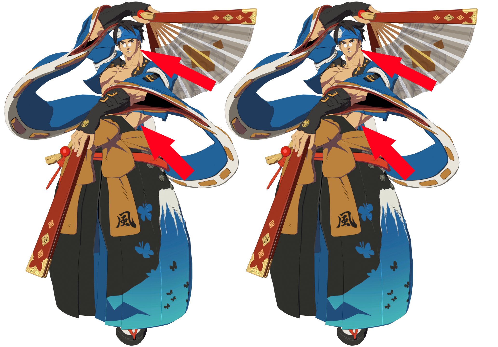
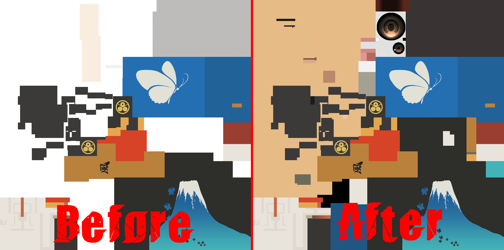

# Edit Base texture
*This section is under construction, and was written by @bafrag*

In this is section you'll know how to edit Base texture and what that is for.

Base texture contains the main colours in the light. Seems like nothing else can be said. But no. It contains not only RGB colours but also Alpha value. Alpha value contains the intensity of the rim light. This is highlight used in photos. Look at Anji's model with Alpha 0 and Alpha 255: 

As you can see, the part of the cheeck and abs when Alpha is 255 more highlighted. That's why you need to leave the OG Alpha mask. If you don't make alpha 255 while colouring, you won't see the colours itself! I'll show how to edit Base in Paint.net and PhotoShop:

## Paint.net
1. First you need to download Alpha to 255 and Alpha to 0 addons for paint.net (Here will be link for addons if I find them)
2. Place those addons in \paint.net\Effects
3. Open Texture. Go to Effects -> Color -> Alpha to 255. Click it. Now you can see the actual colours. 

4. After editing don't forget to save the image.

## PhotoShop
1. Open Texture and just edit as you want. You don't need to set Alpha to 255 to see colours.
2. Who those who want to add the OG alpha mask. Open both edited and original textures in PS. Right click on the Alpha layer on original texture - > duplicate -> Choose the edited one.

### Blender part for who use it
1. Open Blender. Go Edit -> Preferences -> File Paths -> set Image Editor to paintdotnet.exe path
2. Open UV Editor tab and click Image -> Edit Externally
3. After editing in Image Editor press in UV Editor Window either Image -> Reload or Alt+R

Now you can go edit the Sss texture!
