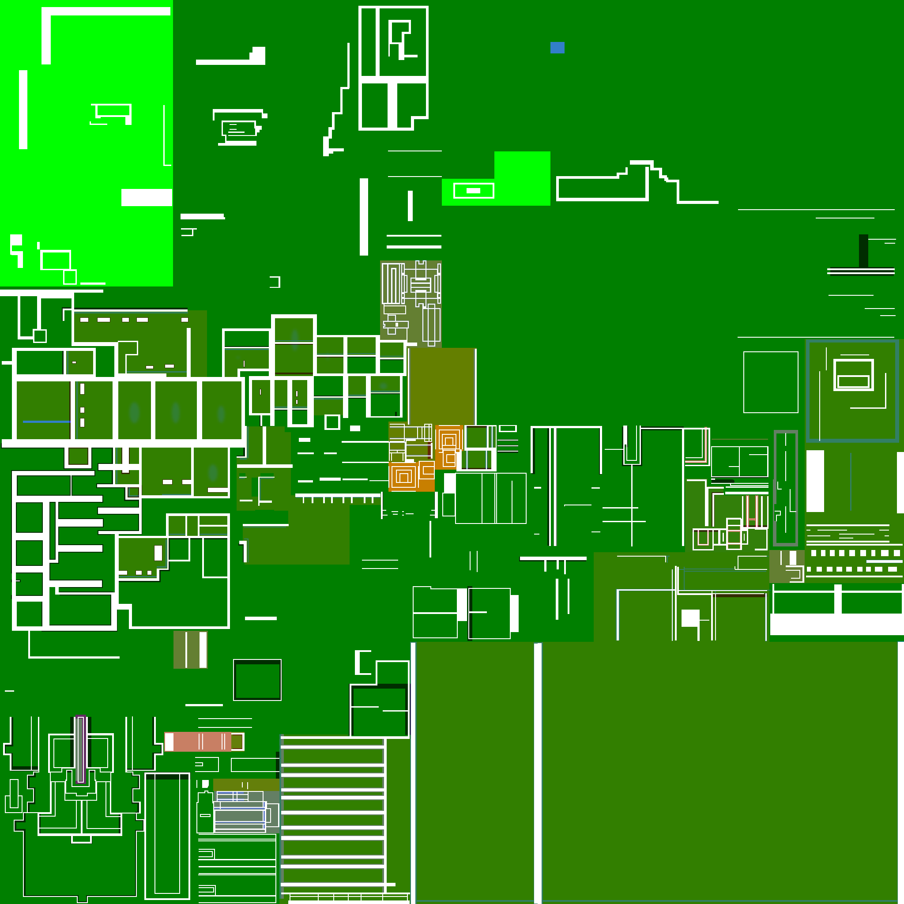
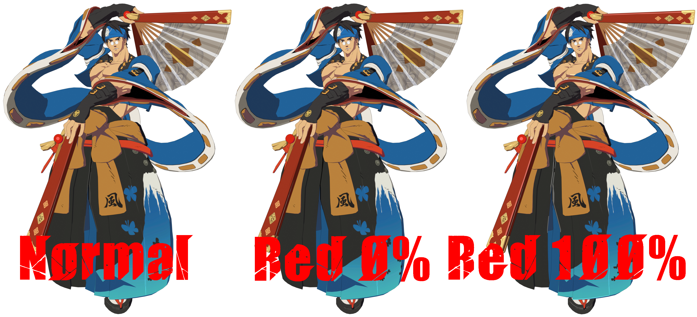
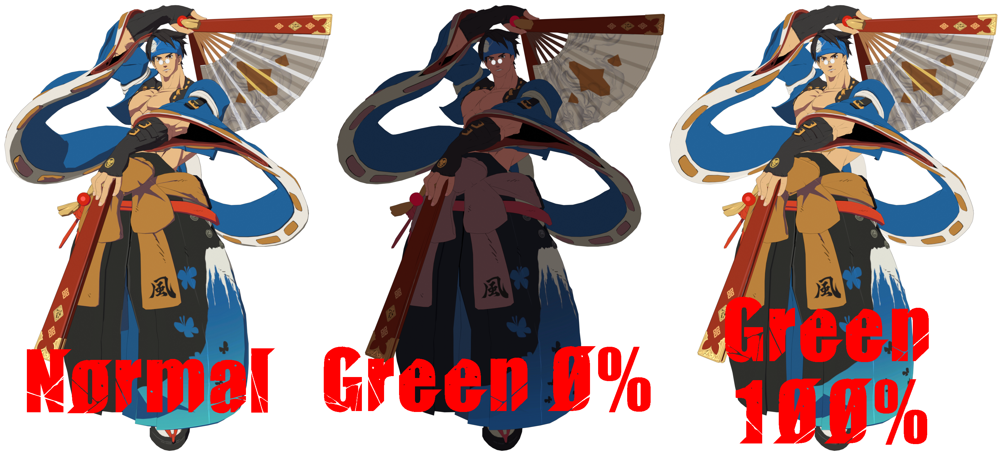
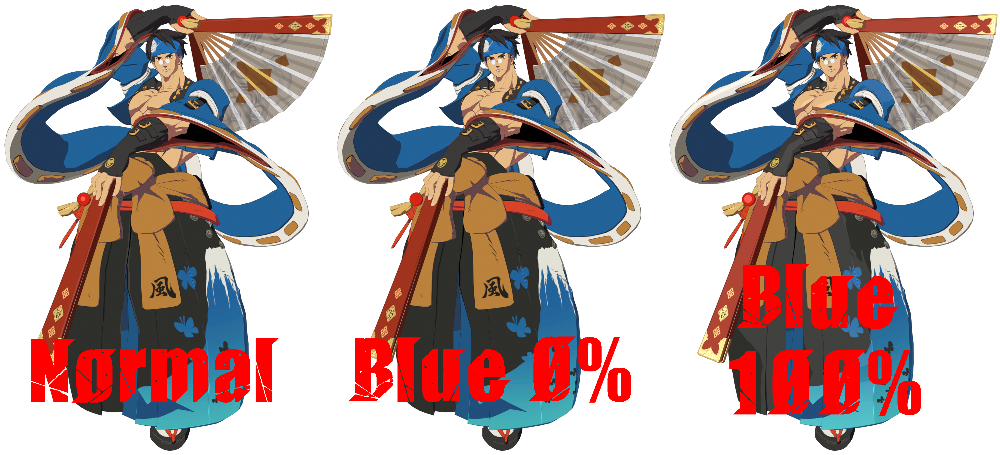
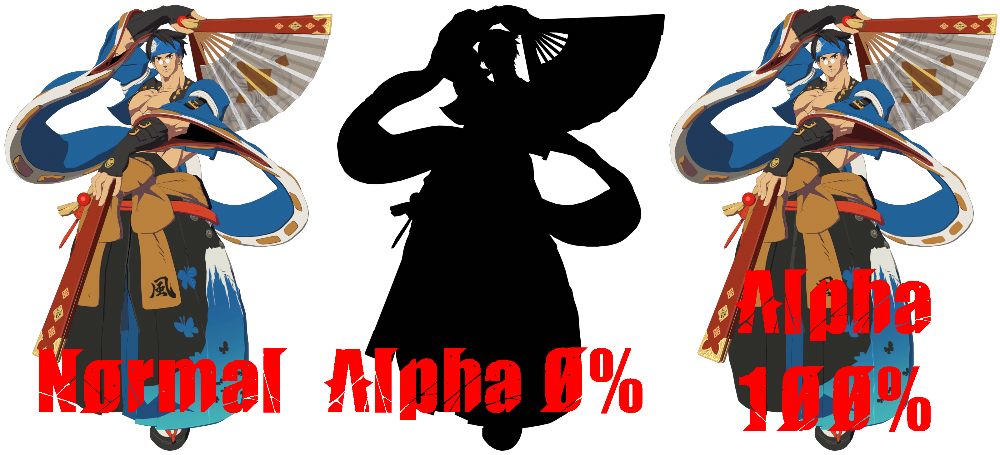

# Edit ILM texture
*This section is under construction, and was written by @bafrag*

In this is section you'll know how to edit Ilm texture and what that is for.

# When you edit ILM texture it affects all colour slots, don't forget it!
The Ilm texture decide how exactly lighting works with the part of the texture. It looks like mess, because it uses each RGBA colour as it's own modifier. Let's look closely: 

## Red:
Red colour stores specular intensity, that often used on metallic part of the model. 

## Green:
Green colour contains shading threshold aka information how dark and when the model become shadowed. 50% is the normal value. Value under 25% will always be shadowed and under 10% always shadowed but with darker tone. Think about it like another high(low)light. 

## Blue:
Blue colour stores highlight power to underline the special part of the model. 0% is no highlight, 50% has highlight and 100% is always highlighted. 

## Alpha:
Alpha contains the black lines on the model. Nothing else to say. 

