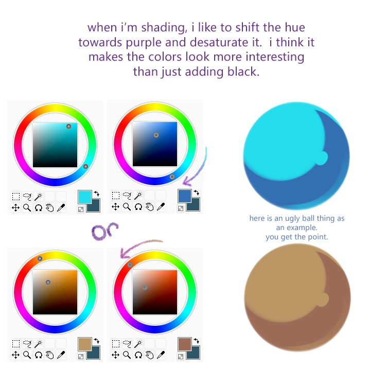
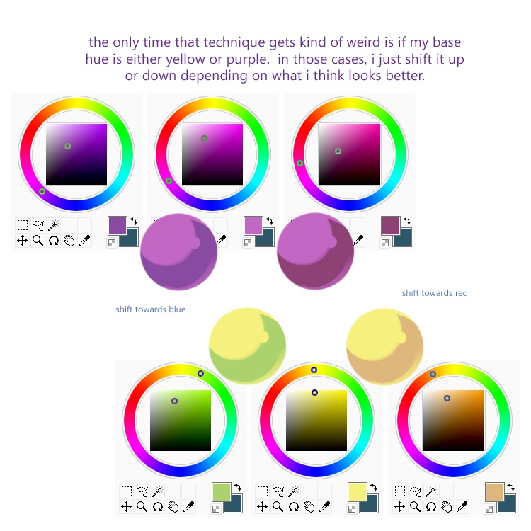

# Edit Sss texture
*This section is under construction, and was written by @bafrag*

In this is section you'll know how to edit Sss texture and what that is for.

Sss texture is the shadow colour of the model. But if you think you can just darken the Base texture, you are very wrong. Every part of the texture need it's own shadow. And just dark is **Soooo** boring. There is a better method called **Hue Shifting**. Here is the bright example of it: 

Additionally you can mess with Alpha value of the texture. This value works with gradient and causes the main amount of problem with textures as written in [Troubleshooting section](troubleshooting\textures.md)
