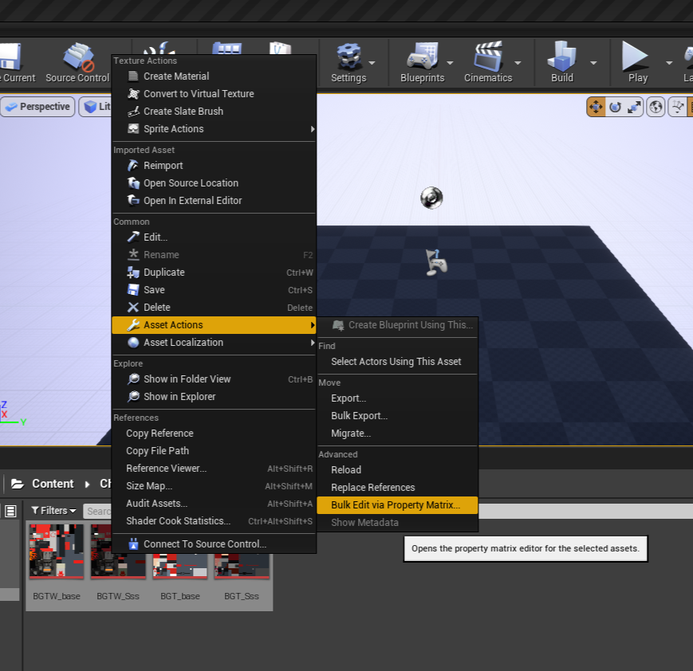
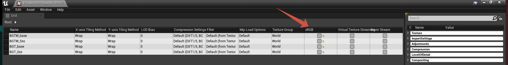

# Export textures to Unreal Engine 4
*This section is under construction, and was written by @bafrag*

In this is section you'll know how to import texture in UE4 and export from it.

 1. Start custom Unreal Engine.
 2. Create new project.
 3. Replicate the folder path. Chara/XX/Costume01/Material/ColorXX
 4. Press "Import" and import the edited textures. 

 5. Select all textures -> Right click -> Asset Actions -> Bulk Edit via Property Matrix -> Uncheck the sRGB from all textures. 

 6. Save all.
 7. File -> Cook project for Windows
 8. Now your cooked files are in ProjectName/Saved/Content/.../ColorXX
 9. Go to [packing section](pak-intro.md)
