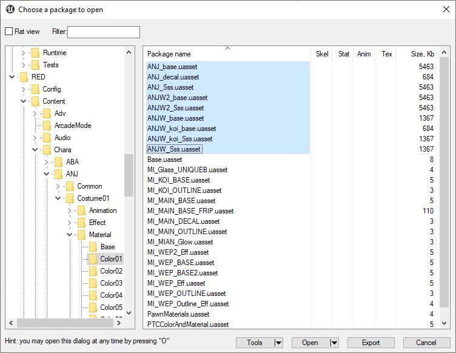
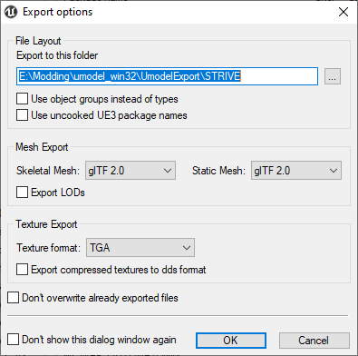

# Extracting Textures
*This section is under construction, and was written by @bafrag*

In this section you'll know how to extract textures from Guilty Gear STRIVE

1. Set up umodel.exe as written in [section 3.2](umodel.md)
2. Navigate to the textures path. It will be Content/Chara/XXX/Costume01/Material/ColorXX. In that image I have selected texture files for Anji for Color01. 
  

3. Press "Export" and set the folder, where all exported exported files go and hit OK. 
  

