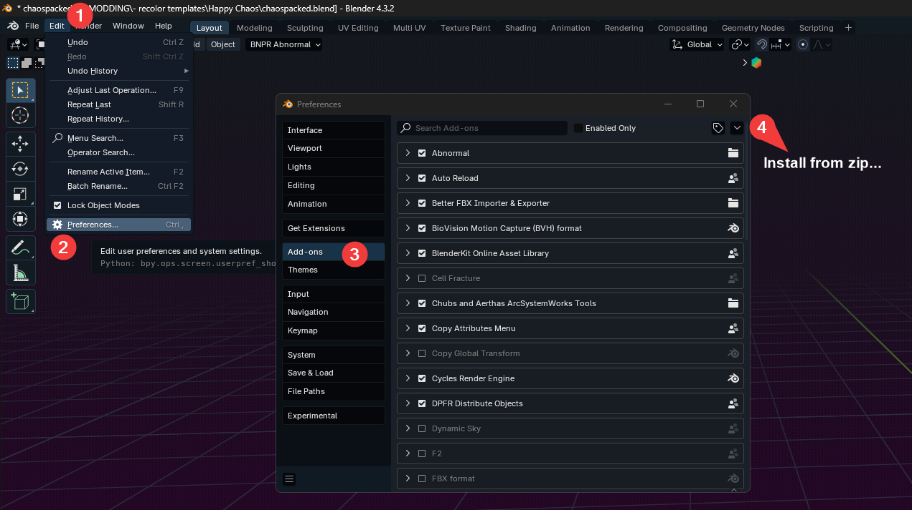

# Using Fmodel
*This section was written by @muuyo*

 

Fmodel is a fairly intuitive piece of software that lets you browse through the game files in a lot less opaque way than Umodel, and as of recently, supports exporting models, materials and animations!

To set it up, you require a bit of legwork.
- Download the **most recent release** of Fmodel [here](https://fmodel.app/). **Make sure once you download that you're running on the most recent release**, by opening Help -> Release and checking if there's more recent versions.
- Put the EXE wherever you'd like (feel free to ignore the other files, they're for compiling)
- Open it, and you'll be presented with a page that looks like this.

Now, you need to add Guilty Gear as a custom game.
- Click the small two arrows, and put in Guilty Gear Strive then browse to the game's file location on your computer. After, hit the small plus.
- Select this newly added game in the Detected Game section.
- Make sure the box beside 'UE versions' is *unchecked*, then select "GAME_UE4_25" (for Unreal version 4.25, which the game uses)
- After, you should be prepped to use Fmodel! Hit OK.  
- At the top left, click Directory, then input the AES key for your game. This should be at the top of your game's `#XXX-resources` channel in the Unreal Anime Mods discord.   
Then you can double click the `pakchunk0-WindowsNoEditor.pak` to start browsing the game's files.

## Audio support

Please view the [audio modding page.](../modding-audio/audio-intro.md)

## Blender

[- You will need the Blender addon linked here to import .ueformat files.](https://github.com/h4lfheart/UEFormat/tree/blender)

To install the above, click the blue "Code" button followed by "Download Zip".
Then, install the addon like so.

FModel supports exporting models and animations to a new "UEFormat", which is more accurate than either PSK/PSA or glTF. To export to UEFormat, open FModel's settings, then click on the `Models` tab. Finally, set `Mesh Format` to `UEFormat (uemodel)`.

Now, you can right-click a model, animation, or folder containing either, and export the models/animations to UEFormat. The attached Blender addon can then import these.

To set up the Blender addon, you will need to download the entire repository (using the blue Code button -> Download Zip)

Then, install this into Blender under `Edit > Preferences > Add-ons > top right arrow > Install From Disk...`

This document will not be going over how to use Fmodel, however it's fairly self explanatory and [it has its own documentation, linked here.](https://github.com/4sval/FModel/wiki)
