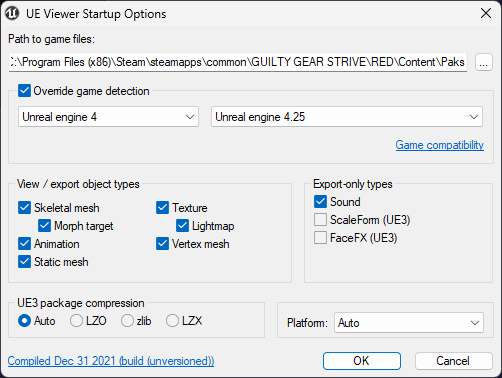

# Using Umodel

Installation is fairly simple, however I would like to note that Umodel is an "older" piece of software. Fmodel is what I prefer for browsing assets, but it doesn't export material names - kinda a pain for mesh modding. As such, please use this for it instead;

- Install Umodel from [this link](files/umodel_animscale.rar) (also available in #strive-resources in the discord)
- Get it opened, point it at your game's install directory and *force the game override to 4.25*
- hit Okay, provide it the AES key `0x3D96F3E41ED4B90B6C96CA3B2393F8911A5F6A48FE71F54B495E8F1AFD94CD73`

Steps 2 and 3 will need to be done *every time you launch*. However, Umodel can be launched with arguments using a shortcut;
mine is configured like such in the Target field, set it up as needed.

`"D:\MODDING\-- PROGRAMS\umodel_win32\umodel.exe" -gui -path="C:\Program Files (x86)\Steam\steamapps\common\GUILTY GEAR STRIVE\RED\Content\Paks" -game="ue4.25" -sounds -aes="0x3D96F3E41ED4B90B6C96CA3B2393F8911A5F6A48FE71F54B495E8F1AFD94CD73"`