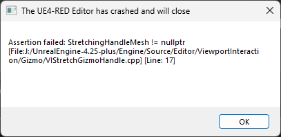

# Installing Unreal Engine
*this section was written by @muuyo*

Arc System Works has customized various aspects of Unreal Engine 4 to suit their needs.

This means that although we can install the plain vanilla UE4 and use that to make mods, we'd be missing on key features needed to make them work properly. Thankfully, Ryn has reverse-engineered several of these changes and implemented some of the key features we require into custom UE4 builds.

You can find the download links below. Just pick the one matching the game you wish to mod. Note that the exact version is important; you cannot do things like use UE4.27 to mod DBFZ.

| Game                          | Engine                                                                                                   |
| ----------------------------- | -------------------------------------------------------------------------------------------------------- |
| Dragon Ball FighterZ          | [Unreal Engine 4.17](https://1drv.ms/u/s!ApT7KvOr_B0hy4ZgwT3lHcwhu3MVSA?e=cTrwqV)                        |
| Guilty Gear \-Strive\-        | [Unreal Engine 4.25 Plus (read below, important)](https://mega.nz/file/jddHjYYS#9rvIZETUKJwCOUfeO43eNvA53333MpTut72GlLRfTv0)  |
| DNF Duel                      | [Unreal Engine 4.25](https://1drv.ms/u/s!ApT7KvOr_B0hkPgRVEhN1MsPEpnAeA?e=bPFdsf)                        |
| Granblue Fantasy Versus       | [Unreal Engine 4.21](https://1drv.ms/u/s!ApT7KvOr_B0hkPgWb5AjxrUapJcYmQ?e=79mVYA)                        |
| Granblue Fantasy Versus Rising | [Unreal Engine 4.27](https://drive.google.com/file/d/1SnX9rcMxeHP82GojHocdLUux2Sa0qZG1/view?usp=sharing) |

The EXE you're going to want to launch to start the project is typically in `Engine/Binaries/Win64/`. 

The Guilty Gear -Strive- editor may receive periodic patches in another archive. You'll need to update it using the steps on the [next page](./custom-project.md) for actually setting up the editor.

## STRIVE SPECIFICS

So! The upload for Strive above is pre-packaged for convenience, and contains a Readme inside.
If this link is down, or you'd rather just the "original" from Ryn rather than it prepackaged, follow the below;

Dropdowns:

 
 <b>Manual setup</b> 

Download here: [https://drive.google.com/drive/u/0/folders/16hIM2Gy7V2Vcc3cpj10nY4emUhqmJwd7](https://drive.google.com/drive/u/0/folders/16hIM2Gy7V2Vcc3cpj10nY4emUhqmJwd7)

Strive has a bit of extra setup that you'll have to do to get it working!  
First, you'll want to download all 3 files from the above link.  
Extract `GGSTCookedEditor` anywhere, and you'll have 2 folders: RED and Engine.  
Extract `CookedEditor_Patch` into the same folder, merging RED with RED and Engine with Engine.  
Drag the Content_Patch contents into RED, then you can go into `RED/Binaries/Win64` to launch the Unreal editor.  
To make a new project to do your own work in, you'll have to follow the directions on the [custom project page](./custom-project.md).

Currently, there's an updated ver of the CharaMaterial folder as well; use this or things bug out.
download from this repo [here](./files/CharaMaterial.zip) then extract it like the above; go into RED/ (your project's folder) then copy Content into there, replacing files when prompted.

<b>Troubleshooting issues</b>

A few things might crop up; some Windows being super annoying, some user error.

  
This error is thrown if the Strive files aren't set up. Run the batch file in the main directory of the download. It *needs* to have the pak set up (it needs the original game's `pakchunk0-WindowsNoEditor.pak` in `RED/Content/Paks`.

An error containing `Error: Failed to load script DLL: [LONG STRING]: Could not load file or assembly 'AutomationScripts.Automation, Version=4.0.0.0, Culture=neutral, PublicKeyToken=null' or one of its dependencies. Operation is not supported.`, or something similar:  

Windows gets pissy when you download files from other people; navigate to the file it's specifying above in the [LONG STRING] bit. For example, `AutomationScripts.Automation.dll`; go there, right click that file, and go into Properties.  
There should be a little box at the bottom saying "Windows blocked this to protect your computer; Unblock", tick that and hit Apply. You might have to do this multiple times.

The symbolic link doesn't work;  
When running `MakeSymbolicLink.bat`, you should get an output with `symbolic link created for (...)`.
If you don't, the symbolic link probably didn't work!
You'll have to make a symbolic link **in** `UnrealEditor/RED/Content/Paks/` **to** (wherever you have strive installed)`GUILTY GEAR STRIVE\RED\Content\Paks\pakchunk0-WindowsNoEditor.pak`.  
[Here's a guide on making them.](https://learn.microsoft.com/en-us/windows-server/administration/windows-commands/mklink)

 

After downloading this copy of UE4, simply extract it somewhere **not managed by Windows** (this means not your desktop, downloads, or other locations in your User folder).  
Then, run MakeSymbolicLink (see Troubleshooting if it doesn't work) then one of the Project batch scripts to get started!

RED's project will have all game assets; I would treat this as primarily read-only. Unreal doesn't play nice with modifying the assets here unless you do some trickery, and it's mainly useful for viewing particle effects to find what to modify, and the like. You can also use it to save some Arcsys-specific assets, such as data assets, to do a bit more involved modding.

The Empty project is set up so you can get started instantly. All settings are already set up to make life easy, and the Shared folder has all materials you would need for instancing / duplicating and modifying set up. Treat this as your working folder.

Finally, - MuuyoTools is a place for a few things I deem excessively helpful. AutoPakker.bat is the main focus, letting you skip ALL manual cooking steps and makes it a **one-click process**. `config.txt` may need editing if things don't work. Fairly simple script.