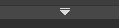
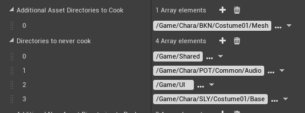

# Getting files into UE4


So! This section is going to be a little long.

- Install Unreal using the pages in the "Installing Unreal" and "Starting The Editor" sections on the left sidebar.
- If you're making a new project (which I usually recommend, view on [this page](./custom-project.md)) to set it up to use an extra project under the Strive dropdown. This lets you handle your "own" files a lot better.


### Textures   

- Drag the textures into Unreal where they need to go, then double click them and set SRGB to Off under the "Texture" dropdown. This is required for most textures - but not UI ones, I believe, notably. If you're noticing your character being strangely darker or lighter, check these.
- You can select multiple files and `Right Click > Asset Actions > Bulk Edit Via Property Matrix` to edit many at once. The right pane toggles settings on all files.
-  Proceed to the Cooking section.

### Meshes
Okay, so;  

- In Blender, make sure you have the FBX export addon (using blender 4.2). The full process is detailed on [the Blender page](../tools/blender.md), under the FBX section.
- Make sure you're going to handle Outlines using one of the methods in [the Outlines page](../modding-mesh/mesh-outlines.md)
- Export the file as you need. *Make sure to check the Blender page above that you've got the correct export settings!*
- Drag it into your character's Mesh folder. Use these specific settings, mostly all necessary:

- Proceed to the cooking section.

### Cooking

### You may want to know that I have scripts that automatically cook, copy, and pack the files all automatically! They're on the [user-made tools page.](../userfiles/main.md) Below config settings still apply.

To make sure you're only cooking the files you want, hit `Edit > Project Settings > (new panel appears) > Packaging`.

  - Then, click the first dropdown under the Packaging section: 
  - Disable Share Material Shader Code if it's not already disabled.
  - These two sections are of great interest:  
   
  - Additional Asset Directories To Cook specifies the specific directories... you want to cook. Point this to your files if you only want to cook those things; as well, it *disables cooking any other files in the project* if this is set.
  - Directories To Never Cook is nice for disabling things. I recommend putting `/Game/Shared` in here no matter what, as it causes Big Problems if you accidentally cook it somehow.
  
Now, to actually cook.  
Hit File at the top left, then hit Cook Content For Windows.  
Wait for this to finish. If it pops up an error, you may have not set up your custom project correctly (or you may have to switch to one); view this section's dropdown for Strive [here.](custom-project.md)  
Now that these files are cooked:

  - You'll need UnrealPak;
  - Copy the cooked files from your cooked folder (such as this, in your project folder: `ProjectName\Saved\Cooked\WindowsNoEditor\ProjectName`) to a subfolder of your UnrealPak folder under RED (e.g., `UnrealPak\[AnyProjectNameYouWant]\RED\`)
  - MAKE SURE you delete Skeletons and such for meshes unless you know what you're doing. You want to delete it in the *cooking step*, so make sure there are no `xxx_body_Skeleton.pak/uexp` or anything similar.
  - Drag this [AnyProjectName] folder onto UnrealPak-With-Compression.bat, it'll create a file called [YourProjectName].pak
  - This is your mod! Install it as with any other mod. 
  - Please note that you'll need a .sig file to go with your mod. For example, this'll look like
```
- Unverum/Mods/ OR Paks/~mods/
-- ModName
--- ModName.pak
--- ModName.sig
```
You can use any sig file from any other mod - all are identical. Copy it from anything you have.  
Note: Sig file needs to have **the exact** same name as the Pak. They can both be named anything, but it has to be identical.  
Your mod should now work! 